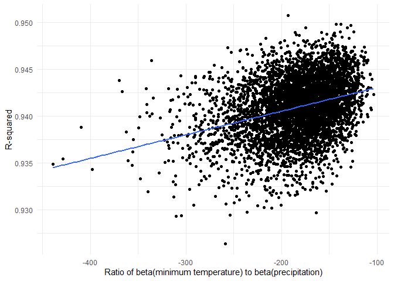
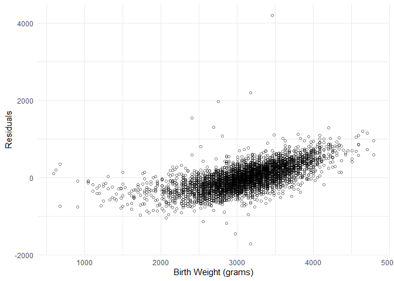
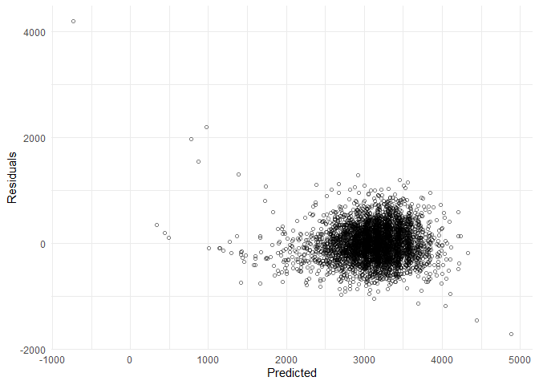
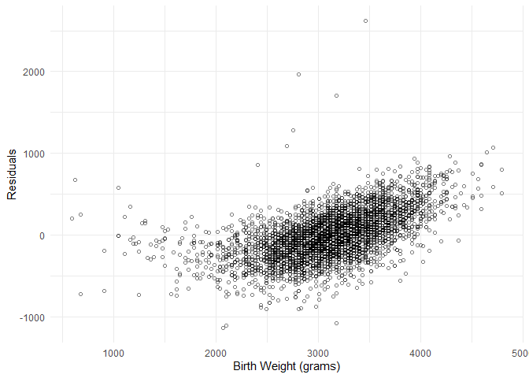
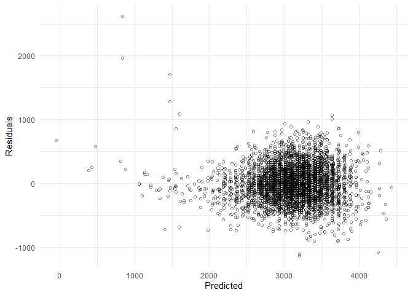
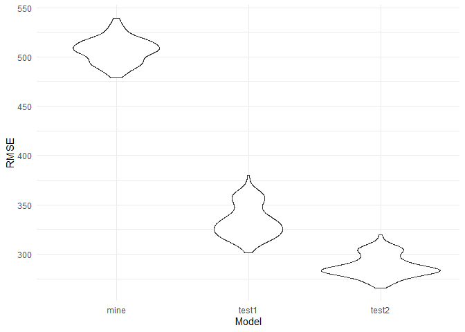

Homework 6
================
Ainsel Levitskaia-Collins, HL2710
2025-11-22

### Problem 2

#### Bootstrapping

Function for sampling for bootstrapping:

``` r
#' Sample for Bootstrapping
#'
#' @param df Dataframe to sample from
#'
#' @returns A sample selected with replacement for bootstrapping
boot_sample = function(df) {
  sample_frac(df, replace = TRUE)
}
```

Tidying and pulling bootstrap samples from `weather_df`:

``` r
weather_df <- weather_df %>% 
  janitor::clean_names()

weather_bootstrap <- tibble(strap_number = 1:5000) %>% 
  mutate(
    strap_sample = map(strap_number, \(i) boot_sample(df = weather_df))
  )
```

Creating a variable for $\frac{\hat{\beta}_{1}}{\hat{\beta}_{2}}$:

``` r
weather_bs_betas <- weather_bootstrap %>% 
  mutate(
    models = map(strap_sample, \(df) lm(tmax ~ tmin + prcp, data = df)),
    results = map(models, broom::tidy)
  ) %>% 
  select(-strap_sample, -models) %>% 
  unnest(results) %>% 
  select(strap_number, term, estimate) %>% 
  pivot_wider(
    names_from = term,
    values_from = estimate
  ) %>% 
  mutate(beta_ratio = tmin / prcp)

head(weather_bs_betas)
```

    ## # A tibble: 6 × 5
    ##   strap_number `(Intercept)`  tmin     prcp beta_ratio
    ##          <int>         <dbl> <dbl>    <dbl>      <dbl>
    ## 1            1          7.83  1.01 -0.00670      -151.
    ## 2            2          7.51  1.02 -0.00557      -184.
    ## 3            3          7.73  1.02 -0.00530      -192.
    ## 4            4          7.90  1.02 -0.00689      -148.
    ## 5            5          7.96  1.01 -0.00476      -212.
    ## 6            6          7.83  1.01 -0.00682      -149.

Collecting $\hat{r}^{2}$ data:

``` r
weather_bs_rsquared <- weather_bootstrap %>% 
  mutate(
    models = map(strap_sample, \(df) lm(tmax ~ tmin + prcp, data = df)),
    results = map(models, broom::glance)
  ) %>% 
  select(-strap_sample, -models) %>% 
  unnest(results)

head(weather_bs_rsquared)
```

    ## # A tibble: 6 × 13
    ##   strap_number r.squared adj.r.squared sigma statistic p.value    df logLik
    ##          <int>     <dbl>         <dbl> <dbl>     <dbl>   <dbl> <dbl>  <dbl>
    ## 1            1     0.941         0.941  2.74    17304.       0     2 -5281.
    ## 2            2     0.944         0.944  2.69    18241.       0     2 -5247.
    ## 3            3     0.939         0.939  2.78    16555.       0     2 -5291.
    ## 4            4     0.939         0.939  2.77    16660.       0     2 -5297.
    ## 5            5     0.937         0.937  2.79    16210.       0     2 -5298.
    ## 6            6     0.943         0.943  2.69    17849.       0     2 -5228.
    ## # ℹ 5 more variables: AIC <dbl>, BIC <dbl>, deviance <dbl>, df.residual <int>,
    ## #   nobs <int>

Merging the two `weather_bs` datasets, so that all the information is in
one place:

``` r
weather_bs <- merge(weather_bs_betas, weather_bs_rsquared, by = "strap_number") %>% 
  select(strap_number, beta_ratio, r.squared)

head(weather_bs)
```

    ##   strap_number beta_ratio r.squared
    ## 1            1  -151.2868 0.9409476
    ## 2            2  -184.1176 0.9436865
    ## 3            3  -191.7096 0.9386516
    ## 4            4  -147.5161 0.9388289
    ## 5            5  -211.5049 0.9373750
    ## 6            6  -148.6848 0.9427217

#### Plot of the ratio of betas vs r-squared

``` r
plot_weather_estimates <- weather_bs %>% 
  ggplot(aes(x = beta_ratio, y = r.squared)) +
  geom_point() +
  geom_smooth(method = lm, se = FALSE) +
  theme_minimal() +
  xlab("Ratio of beta(minimum temperature) to beta(precipitation)") +
  ylab("R-squared")

plot_weather_estimates
```

<!-- -->

As the ratio between the minimum temperature $\hat{\beta}_{1}$ and
precipitation $\hat{\beta}_{2}$ decreases, the $\hat{r}^{2}$ value tends
to increase.

#### Confidence Interval

``` r
weather_bs_ci <- tibble(
  beta_ratio = quantile(pull(weather_bs, beta_ratio), probs = c(0.025, 0.975)),
  r_squared = quantile(pull(weather_bs, r.squared), probs = c(0.025, 0.975))
)
```

The 95% confidence interval for $\hat{r}^{2}$ is (0.93, 0.95). The 95%
confidence interval for $\frac{\hat{\beta}_{1}}{\hat{\beta}_{2}}$ is
(-282.7, -124.5).

### Problem 3

Loading and cleaning `birthweight` dataset, including renaming variables
to something less confusing and lightly reorganizing the variable order:

``` r
birthweight <- read_csv("./data/birthweight.csv") %>% 
  janitor::clean_names() %>% 
  mutate(
    babysex = case_match(babysex,
                         1 ~ "Male",
                         2 ~ "Female"),
    frace = case_match(frace,
                       1 ~ "White",
                       2 ~ "Black",
                       3 ~ "Asian",
                       4 ~ "Puerto Rican",
                       8 ~ "Other",
                       9 ~ "Unknown"),
    mrace = case_match(mrace,
                       1 ~ "White",
                       2 ~ "Black",
                       3 ~ "Asian",
                       4 ~ "Puerto Rican",
                       8 ~ "Other")) %>% 
  rename(
    b_sex = babysex, 
    b_head_cents = bhead, 
    b_length_cents = blength, 
    b_weight_grams = bwt, 
    del_weight_lbs = delwt, 
    fam_income_hunds = fincome, 
    f_race = frace, 
    b_gweeks = gaweeks, 
    b_malform = malform,
    m_menarche_yrs = menarche, 
    m_height_ins = mheight, 
    m_age_yrs = momage, 
    m_race = mrace, 
    num_parity = parity, 
    num_lbw = pnumlbw, 
    num_sga = pnumsga, 
    m_ppbmi = ppbmi, 
    m_ppweight_lbs = ppwt, 
    m_cigs = smoken, 
    m_wtgain_lbs = wtgain) %>% 
  select(b_sex, b_head_cents, b_length_cents, b_weight_grams, b_gweeks, 
         b_malform, del_weight_lbs, fam_income_hunds, f_race, m_menarche_yrs, 
         m_height_ins, m_age_yrs, m_race, m_ppbmi, m_ppweight_lbs, m_cigs, 
         m_wtgain_lbs, num_parity, num_lbw, num_sga)

head(birthweight)
```

    ## # A tibble: 6 × 20
    ##   b_sex  b_head_cents b_length_cents b_weight_grams b_gweeks b_malform
    ##   <chr>         <dbl>          <dbl>          <dbl>    <dbl>     <dbl>
    ## 1 Female           34             51           3629     39.9         0
    ## 2 Male             34             48           3062     25.9         0
    ## 3 Female           36             50           3345     39.9         0
    ## 4 Male             34             52           3062     40           0
    ## 5 Female           34             52           3374     41.6         0
    ## 6 Male             33             52           3374     40.7         0
    ## # ℹ 14 more variables: del_weight_lbs <dbl>, fam_income_hunds <dbl>,
    ## #   f_race <chr>, m_menarche_yrs <dbl>, m_height_ins <dbl>, m_age_yrs <dbl>,
    ## #   m_race <chr>, m_ppbmi <dbl>, m_ppweight_lbs <dbl>, m_cigs <dbl>,
    ## #   m_wtgain_lbs <dbl>, num_parity <dbl>, num_lbw <dbl>, num_sga <dbl>

#### My model; comparing birth weight against the mother’s pre-pregnancy BMI and cigarettes smoked during pregnancy

This model is based on the theory that a mother of poor health (either
too low or too high of a BMI, and smoking during pregnancy) will
contribute to the potential of a baby’s birth weight being unusual.

Fitting the model:

``` r
birthweight_model1 <- lm(b_weight_grams ~ m_ppbmi + m_cigs, data = birthweight)

birthweight_model1 %>% 
  broom::tidy() %>% 
  mutate(term = case_match(term,
                           "(Intercept)" ~ "Intercept",
                           "m_ppbmi" ~ "Pre-Pregnancy BMI",
                           "m_cigs" ~ "Cigarettes Smoked During Pregnancy")) %>% 
  knitr::kable(digits = 2, col.names = c("Term", "Estimate", "Standard Error", "Statistic", "P-Value"))
```

| Term                               | Estimate | Standard Error | Statistic | P-Value |
|:-----------------------------------|---------:|---------------:|----------:|--------:|
| Intercept                          |  2808.26 |          53.03 |     52.96 |       0 |
| Pre-Pregnancy BMI                  |    15.21 |           2.43 |      6.27 |       0 |
| Cigarettes Smoked During Pregnancy |    -5.27 |           1.04 |     -5.06 |       0 |

Testing model fit:

``` r
birthweight_model1_rplot <- birthweight %>% 
  modelr::add_residuals(birthweight_model1) %>% 
  ggplot(aes(x = b_weight_grams, y = resid)) +
  geom_point(alpha = 0.5, shape = 1) +
  theme_minimal() +
  xlab("Birth Weight (grams)") +
  ylab("Residuals")

birthweight_model1_rplot

birthweight_model1_rpplot <- birthweight %>% 
  modelr::add_residuals(birthweight_model1) %>% 
  modelr::add_predictions(birthweight_model1) %>% 
  ggplot(aes(x = pred, y = resid)) +
  geom_point(alpha = 0.5, shape = 1) +
  theme_minimal() +
  xlab("Predicted") +
  ylab("Residuals")

birthweight_model1_rpplot
```


This model, when considered independently, looks like a good fit for the
data; when comparing the residuals against the birth weight variable,
the residuals follow a very linear path with few outliers. When compared
against predicted values, the shape of the residuals plot is generally
symmetrical and clustered at the center of the plot with no clear
pattern.

#### Test Model 1: birthweight compared against length at birth and gestational age (no interaction)

Fitting the model:

``` r
birthweight_model2 <- lm(b_weight_grams ~ b_length_cents + b_gweeks, data = birthweight)

birthweight_model2 %>% 
  broom::tidy() %>% 
  mutate(term = case_match(term,
                           "(Intercept)" ~ "Intercept",
                           "b_length_cents" ~ "Length at Birth (centimeters)",
                           "b_gweeks" ~ "Gestational Weeks")) %>% 
  knitr::kable(digits = 2, col.names = c("Term", "Estimate", "Standard Error", "Statistic", "P-Value"))
```

| Term                          | Estimate | Standard Error | Statistic | P-Value |
|:------------------------------|---------:|---------------:|----------:|--------:|
| Intercept                     | -4347.67 |          97.96 |    -44.38 |       0 |
| Length at Birth (centimeters) |   128.56 |           1.99 |     64.60 |       0 |
| Gestational Weeks             |    27.05 |           1.72 |     15.74 |       0 |

Testing the model fit:

``` r
birthweight_model2_rplot <- birthweight %>% 
  modelr::add_residuals(birthweight_model2) %>% 
  ggplot(aes(x = b_weight_grams, y = resid)) +
  geom_point(alpha = 0.5, shape = 1) +
  theme_minimal() +
  xlab("Birth Weight (grams)") +
  ylab("Residuals")

birthweight_model2_rplot

birthweight_model2_rpplot <- birthweight %>% 
  modelr::add_residuals(birthweight_model2) %>% 
  modelr::add_predictions(birthweight_model2) %>% 
  ggplot(aes(x = pred, y = resid)) +
  geom_point(alpha = 0.5, shape = 1) +
  theme_minimal() +
  xlab("Predicted") +
  ylab("Residuals")

birthweight_model2_rpplot
```



This model, when considered independently, does not look like a good fit
for the data; when comparing the residuals against the birth weight
variable, the residuals do not follow a perfect linear path and see some
spread. When compared against predicted values, the residuals cluster
off-center, with a few notable outliers.

### Test model 2: birthweight compared against head circumference, length, and sex (with interaction)

Fitting the model:

``` r
birthweight_model3 <- lm(b_weight_grams ~ b_head_cents * b_length_cents * b_sex, data = birthweight)

birthweight_model3 %>% 
  broom::tidy() %>% 
  mutate(term = case_match(term,
                           "(Intercept)" ~ "Intercept",
                           "b_head_cents" ~ "Head Circumference at Birth (centimeters)",
                           "b_length_cents" ~ "Length at Birth (Centimeters)",
                           "b_sexMale" ~ "Gender (Male)",
                           "b_head_cents:b_length_cents" ~ "Head Circumference x Length",
                           "b_head_cents:b_sexMale" ~ "Head Circumference x Gender (Male)",
                           "b_length_cents:b_sexMale" ~ "Length x Gender (Male)",
                           "b_head_cents:b_length_cents:b_sexMale" ~ "Head Circumference x Length x Gender (Male)")) %>% 
  knitr::kable(digits = 2, col.names = c("Term", "Estimate", "Standard Error", "Statistic", "P-Value"))
```

| Term | Estimate | Standard Error | Statistic | P-Value |
|:---|---:|---:|---:|---:|
| Intercept | -801.95 | 1102.31 | -0.73 | 0.47 |
| Head Circumference at Birth (centimeters) | -16.60 | 34.09 | -0.49 | 0.63 |
| Length at Birth (Centimeters) | -21.65 | 23.37 | -0.93 | 0.35 |
| Gender (Male) | -6374.87 | 1677.77 | -3.80 | 0.00 |
| Head Circumference x Length | 3.32 | 0.71 | 4.67 | 0.00 |
| Head Circumference x Gender (Male) | 198.39 | 51.09 | 3.88 | 0.00 |
| Length x Gender (Male) | 123.77 | 35.12 | 3.52 | 0.00 |
| Head Circumference x Length x Gender (Male) | -3.88 | 1.06 | -3.67 | 0.00 |

Testing the model fit:

``` r
birthweight_model3_rplot <- birthweight %>% 
  modelr::add_residuals(birthweight_model3) %>% 
  ggplot(aes(x = b_weight_grams, y = resid)) +
  geom_point(alpha = 0.5, shape = 1) +
  theme_minimal() +
  xlab("Birth Weight (grams)") +
  ylab("Residuals")

birthweight_model3_rplot

birthweight_model3_rpplot <- birthweight %>% 
  modelr::add_residuals(birthweight_model3) %>% 
  modelr::add_predictions(birthweight_model3) %>% 
  ggplot(aes(x = pred, y = resid)) +
  geom_point(alpha = 0.5, shape = 1) +
  theme_minimal() +
  xlab("Predicted") +
  ylab("Residuals")

birthweight_model3_rpplot
```



This model, when considered independently, does not look like a good fit
for the data; when comparing the residuals against the birth weight
variable, the residuals do not follow a perfect linear path and see some
spread. When compared against predicted values, the residuals cluster
off-center, with a few notable outliers. This fit overall reseambles the
fit of test model 1.

#### Comparing All Models

Fitting models and obtaining RMSEs:

``` r
birthweight_cv_df <- modelr::crossv_mc(birthweight, 100) %>% 
  mutate(
    model_mine = map(train, \(df) lm(b_weight_grams ~ m_ppbmi + m_cigs, data = df)),
    model_test1 = map(train, \(df) lm(b_weight_grams ~ b_length_cents + b_gweeks, data = df)),
    model_test2 = map(train, \(df) lm(b_weight_grams ~ b_head_cents * b_length_cents * b_sex, data = df))
  ) %>% 
  mutate(
    rmse_mine = map2_dbl(model_mine, test, \(mod, df) modelr::rmse(model = mod, data = df)),
    rmse_test1 = map2_dbl(model_test1, test, \(mod, df) modelr::rmse(model = mod, data = df)),
    rmse_test2 = map2_dbl(model_test2, test, \(mod, df) modelr::rmse(model = mod, data = df))
  )
```

Testing model fits:

``` r
plot_bw_cv <- birthweight_cv_df %>% 
  select(starts_with("rmse")) %>% 
  pivot_longer(
    everything(),
    names_to = "model",
    values_to = "rmse",
    names_prefix = "rmse_"
  ) %>% 
  mutate(model = fct_inorder(model)) %>% 
  ggplot(aes(x = model, y = rmse)) +
  geom_violin() +
  theme_minimal() +
  xlab("Model") +
  ylab("RMSE")

plot_bw_cv
```

<!-- -->

Based on this model comparison, the test 2 model (comparing head
circumference, length, and sex with interaction) is the best fit for the
data, as its range of RMSE values is the lowest out of all available
values.
